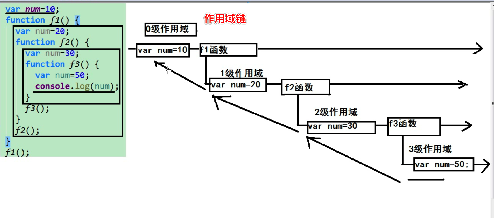
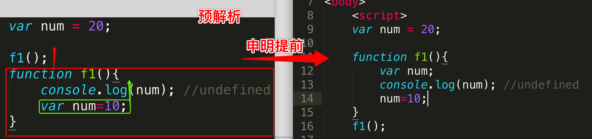
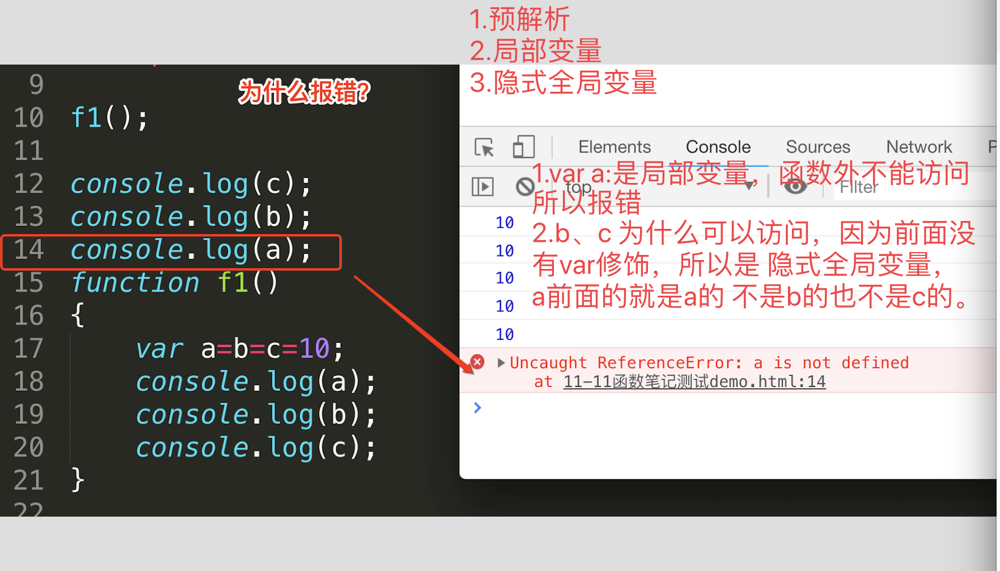

### 一简介

发明人：布兰登-艾奇,1995年 34岁,用十天时间发明了JavaScript语言—------浏览器上应用最广泛的脚本语言之一。Brendan Eich的主要兴趣和方向是函数式编程。

``所以，Javascript语言实际上是两种语言风格的混合产物----(简化的)函数式编程+(简化的)面向对象编程。 这是由Brendan Eich(函数式编程)与网景公司(面向对象编程)共同决定的 。 ``

JS是一门什么样的语言：

```
1.js是一门解释性的语言
2，是一门弱类型的语言,定义变量都用var
3.是一门基于对象的语言:系统内置了一些对象可以直接使用。
4.是一门动态性的语言。
```

### 函数

对比OC、C语言的函数，有不一样的地方：

```
1.js是弱类型的语言，申明变量都用var, 
函数不指定返回值类型，参数不指定类型，第一接触有点不习惯，这也从另一个角度说明了js是又是一种动态性的语言，运行到这一行代码才知道他是什么类型，
2.关于返回值的问题，一眼看不出来一个函数是否有返回值，不像OC、C都必须明确指定返回值类型，编译器会严格检查,有问题是会报错的。js是一门解释性语言,定义函数的时候是不指定返回值的，这一点不太习惯。
//js
function f1(x,y){
    return x+y;
}

//OC
- (int)addNum1:(int)num1 num2:(int)num2 {
    return num1 + num2;
}
.还是js写法简洁、方便。
4.调用都差不多。
```

#### arguments （新）

arguments: 是一个对象，是一个伪数组，用处：用来获取函数调用时传入的参数的信息。

arguments.length; //函数调用时传进来的参数的个数

arguments[索引];  //参数的值

Eg:

```
function f(x,y){
			console.log(arguments);
			console.log(arguments.length);
			console.log(arguments[0]);
		}
f(30,40);
```


#### 函数的其他定义方式

1、有名函数：function 函数名() {函数体,如果需要返回值就直接 return xxx;}

```
//定义函数
function f1(a,b){
	console.log(a+b);
}
//调用
f1(2,3);
```

2、匿名函数：函数没有名字就是，匿名函数，？没有体会到他的作用

```
(function(){
	console.log("匿名函数");
 })(); //匿名函数的自调用, 一次性的
```


3、函数表达式：函数的另一定义方式。

把一个函数赋值给一个 变量，就构成了函数表达式。

函数也是一种数据类型：使用typeof 获取一个变量的类型

```
var f1 = function(){
	console.log("函数表达式");
}
f1();
//函数也是一种数据类型。
console.log(typeof(f1)); //function

```

4.函数作为参数:

```
function sayHi(fn) {
	console.log("你好！");
	console.log(arguments);
	fn();
}
//问题❓函数如果有参数的话，怎么传参 ❓
function mayunSay(x,y) 	{
	console.log("双十一尽情的剁手");
}
sayHi(mayunSay(1,1)); //报错。
```

#### 作用域:使用范围

```
1.全局变量： 使用var申明的变量，除函数外，其他任意位置申明的变量都是全局变量，全局变量可以在页面的任意位置使用。
全局变量，如果页面不关闭，就不会被释放，就会占空间、消耗内存。
2.局部变量：在函数内部使用var定义的变量是局部变量。
3。隐式全局变量：没有var申明的变量。就叫隐式全局变量
function f1(){
	var a=b=c;  
	//1。只有a有var修饰，b,c 都没有var修饰，不要想当然的认为b、c都有var修饰
	2.结果就是。a是局部变量；b、c是隐式全局变量，外面是可以访问的。
}

全局作用域：全局变量的使用范围。
局部作用域：局部变量的使用范围。
块级作用域：{} 块，只能在块中使用。
说明：JS中没有块级作用域,函数除外。
```


#### 作用域链

 

#### 预解析:提前解析

预解析做了什么?

把变量的申明提前了——— 提到当前所在作用域的最上面。

把函数的声明提前了——— 提到当前所在作用域的最上面。



```
eg1:
var num = 20;
f1(); 
function f1(){	
	console.log(num); //undefined	
	//1.预解析,变量申明提前，2.函数内部使用var申明的变量是局部变量	
	//3.作用域链,从内往外找。所以是undefined。	
	var num=10;
}
```

```
eg2: 
f1();  //报错：f1 is not a function 。
//解释原因:1.这是一个函数表达式，var 就是一个变量(不确定类型)只有只想到 = function(){xxxxx} 才能确定他是一个函数。
但是:2.代码从上到下顺序执行，没有定义f1();---->报错。
var f1 = function () {
	console.log(a);
    var a=10;
};
f2();
function f2() { }
```

```
eg3:
f1();

console.log(c);
console.log(b);
console.log(a);
function f1()
{
	var a=b=c=10;
	console.log(a);
	console.log(b);
	console.log(c);
}

```



对象。构造函数、自定义构造函数图解。

